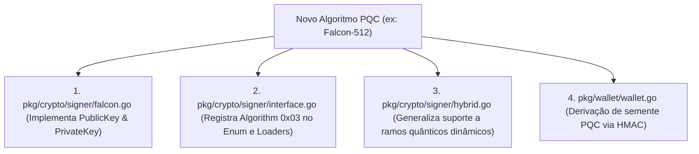

# 🛡️ Parecer Técnico: Agilidade Criptográfica e Transição Pós-Quântica na Jamii Blockchain

**Projeto:** Jamii Blockchain  
**Data:** 21 de Agosto de 2026  
**Assunto:** Avaliação da Agilidade Criptográfica (*Signature Agility*) e Nível de Esforço para Substituição ou Adição de Algoritmos Pós-Quânticos (ML-DSA, Falcon-512 e SLH-DSA).

---

## Executive Summary (Resumo Executivo)

Este parecer técnico avalia a resiliência arquitetural e a **Agilidade Criptográfica (*Signature Agility*)** da **Jamii Blockchain** perante a evolução dos padrões pós-quânticos do NIST e potenciais vetores de criptanálise.

**Conclusão Principal:**  
O nível de esforço para substituir o **ML-DSA-65** pelo **Falcon-512** ou pelo **SLH-DSA (SPHINCS+)** — ou para suportar múltiplos algoritmos simultaneamente — é **BAIXO A MÉDIO** (estimado em **2 a 4 dias de desenvolvimento e validação**). 

A Jamii foi projetada com desacoplamento rigoroso entre a camada de aplicação/consenso e a camada criptográfica. Consequentemente:
1. **Sem Alteração no Formato de Transação:** O protocolo wire SSZ utiliza offsets dinâmicos de 32-bit e suporta tamanhos variáveis de chave/assinatura sem exigir alterações estruturais.
2. **Sem Alteração no Formato de Endereço:** O endereço soberano (`jamii1...`) possui um payload de 20 bytes derivado da âncora tradicional (Keccak-256), permanecendo invariante à troca do algoritmo quântico.
3. **Sem Quebra de Compatibilidade na VM e Consenso:** O motor de execução e o consenso IBFT operam exclusivamente sobre interfaces polimórficas (`signer.PublicKey` e `signer.PrivateKey`).

---

## 1. Arquitetura de Agilidade Criptográfica da Jamii

A arquitetura da Jamii implementa quatro mecanismos fundamentais que garantem a **Signature Agility**:

### 1.1. Identificadores Auto-descritivos (`Algorithm ID`)
Todas as chaves públicas e privadas serializadas na rede possuem um prefixo obrigatório de 1 byte (`Algorithm uint8` em [`pkg/crypto/signer/interface.go`](file:///C:/Magno/Projetos/jamii/pkg/crypto/signer/interface.go#L23-L37)):
- `0x00`: `Secp256k1` (Compatibilidade ECDSA / Ethereum)
- `0x01`: `MLDSA65` (NIST FIPS 204 - Dilithium)
- `0x02`: `Hybrid` (Dual-Security: Secp256k1 + ML-DSA-65)
- `0x03` (Proposto): `Falcon512` (NIST FIPS Round 4)
- `0x04` (Proposto): `SLHDSA128f` (NIST FIPS 205 - SPHINCS+)

Ao receber um payload binário, o sistema identifica instantaneamente o esquema criptográfico sem necessidade de adivinhação ou parâmetros globais rígidos.

### 1.2. Abstração Polimórfica via Interfaces Soberanas
Módulos como a VM, StateDB, MemPool, Consenso IBFT e P2P interagem com a criptografia através das interfaces `PublicKey` e `PrivateKey` em [`pkg/crypto/signer/interface.go`](file:///C:/Magno/Projetos/jamii/pkg/crypto/signer/interface.go#L41-L71). 
Métodos como `Verify(message, signature)` e `SignatureSize()` encapsulam o comportamento e os tamanhos específicos de cada algoritmo, mantendo a camada de consenso agnóstica às especificidades matemáticas da curva ou rede (*lattice*).

### 1.3. Codificador Binário SSZ com Offsets Dinâmicos
No módulo [`pkg/encoding/transaction.go`](file:///C:/Magno/Projetos/jamii/pkg/encoding/transaction.go#L307-L324), a serialização da transação utiliza uma tabela de offsets de 32 bits para delimitar campos de tamanho variável como `PubKey` e `Signature`. 
Diferente do Ethereum clássico (que exige exatamente 65 bytes de assinatura R/S/V), a Jamii aceita qualquer assinatura válida, seja ela de 666 bytes (Falcon), 3.3 KB (ML-DSA) ou 7.8 KB (SLH-DSA), sem romper a canonicidade do enquadramento binário.

### 1.4. Endereçamento Ancorado e Invariante
Em [`pkg/types/address.go`](file:///C:/Magno/Projetos/jamii/pkg/types/address.go#L229-L259), o `DeriveSovereignAddress` gera o payload de 20 bytes ancorando na chave pública tradicional (Secp256k1). 
Como o tamanho do endereço é fixo (21 bytes total: 1 byte de versão + 20 bytes de payload), **a troca do algoritmo pós-quântico não altera as carteiras, os endereços `jamii1...` ou o espelhamento de contas no StateDB.**

---

## 2. Comparativo Técnico de Algoritmos Pós-Quânticos

Caso o NIST finalize a padronização do Falcon ou se o ML-DSA-65 necessite de substituição, a tabela a seguir apresenta os impactos no protocolo:

| Métrica | ML-DSA-65 (Atual - FIPS 204) | Falcon-512 (FIPS Round 4) | SLH-DSA-128f (SPHINCS+ - FIPS 205) |
| :--- | :--- | :--- | :--- |
| **Premissa Matemática** | Lattices (Module-LWE/SIS) | Lattices (NTRU) | Baseado em Hashes (Stateless) |
| **Chave Pública** | 1.952 bytes (+1 prefixo) | **897 bytes** (🔻 ~54% menor) | **32 bytes** (🔻 ~98% menor) |
| **Chave Privada** | 4.032 bytes (+1 prefixo) | 1.281 bytes | 64 bytes |
| **Tamanho da Assinatura** | 3.309 bytes | **666 bytes** (🔻 ~80% menor) | **7.856 bytes** (🔺 ~137% maior) |
| **Velocidade Verificação** | Muito Rápida | **Extremamente Rápida** | Lenta (Múltiplas árvores Merkle/WOTS+) |
| **Impacto no Bandwidth** | Médio | **Excelente** (Ideal para IoT e P2P) | **Alto** (Infla tamanho dos blocos) |
| **Nível de Conservadorismo** | Alto | Médio-Alto | **Máximo** (Livre de hipóteses de redes) |

### Análise dos Candidatos:
- **Falcon-512 (Eficiência Máxima):** Apresenta assinaturas de apenas 666 bytes (redução de 80% em relação ao ML-DSA-65). É a opção mais eficiente para reduzir tráfego P2P e footprint em disco, mantendo tempos de verificação ultrarrápidos.
- **SLH-DSA / SPHINCS+ (Segurança Absoluta):** Baseia-se exclusivamente na segurança de funções de hash (SHA-2/SHAKE). Se os algoritmos de redes (*lattices*) sofrerem um avanço de criptanálise no futuro, o SLH-DSA atua como o "porto seguro" inquebrável, ao custo de assinaturas maiores (~7.8 KB).

---

## 3. Mapeamento de Alterações para Troca/Adição de Algoritmo

Para integrar um novo algoritmo pós-quântico na Jamii, a intervenção fica restrita aos seguintes pontos do código-fonte:

### Detalhamento dos Passos:

1. **Implementação do Driver (`pkg/crypto/signer/falcon.go` ou `slhdsa.go`):**
   - Implementar `mldsa`-like struct conformando com `signer.PublicKey` e `signer.PrivateKey`.
   - Métodos: `Algorithm()`, `Bytes()`, `Verify()`, `SignatureSize()`, `Sign()`, `SignTo()`, `Zero()`.

2. **Registro de Algoritmo (`pkg/crypto/signer/interface.go`):**
   - Adicionar a constante no enum `Algorithm` (`Falcon512 Algorithm = 0x03`).
   - Adicionar a ramificação no `LoadSovereignPublicKey` e `LoadSovereignPrivateKey`.

3. **Flexibilização do Esquema Híbrido (`pkg/crypto/signer/hybrid.go`):**
   - Em [`LoadHybridPublicKey`](file:///C:/Magno/Projetos/jamii/pkg/crypto/signer/hybrid.go#L294) e `LoadHybridPrivateKey`, substituir a checagem fixa de `MLDSA65` por uma validação aceitando qualquer algoritmo quântico reconhecido pelo registro (`MLDSA65`, `Falcon512`, `SLHDSA128`).

4. **Derivação Determinística na Carteira (`pkg/wallet/wallet.go`):**
   - Atualizar [`FromMnemonic`](file:///C:/Magno/Projetos/jamii/pkg/wallet/wallet.go#L109-L119) para derivar sementes pós-quânticas específicas por algoritmo através de HMAC com separação de domínio (ex: `HMAC("Jamii Falcon Seed")`).

---

## 4. Estratégia de Transição em Rede Ativa (Hard-Fork / Soft-Fork Agility)

Devido ao campo `Algorithm ID` estar presente em cada chave pública, a Jamii pode executar upgrades de criptografia sem interromper a rede:

1. **Fase Multi-Algoritmo (Transição Gradual):**
   A rede passa a aceitar transações e blocos contendo identidades `Hybrid-MLDSA` (`0x02`) e `Hybrid-Falcon` (`0x03`) em paralelo.
2. **Depreciação Controlada por Altura de Bloco:**
   Em caso de vulnerabilidade descoberta em um algoritmo específico, um soft-fork ativa uma regra no MemPool e no Processador de Bloco:
   $$\text{Block.Number} \ge H_{\text{fork}} \implies \text{Reject transactions where } \text{Algo} = 0x01$$
   Usuários podem continuar usando a mesma semente BIP-39 e os mesmos endereços `jamii1...`, assinando com o novo algoritmo ativado.

---

## 5. Parecer Final

> **A Jamii Blockchain preenche com sucesso o requisito de Agilidade Criptográfica (Signature Agility).**  
> Diferente de blockchains legadas (como Ethereum e Bitcoin), que possuem forte acoplamento com o ECDSA/Secp256k1 de 65 bytes e endereços derivados diretamente da chave pública legada, a Jamii pode trocar ou adicionar algoritmos pós-quânticos como Falcon-512 ou SLH-DSA com **mínimo esforço de engenharia (2 a 4 dias)** e **zero impacto na camada de estado, contratos ou endereçamento da rede**.

---

## 6. Soluções Adotadas e Evoluções Implementadas

Como evolução direta deste parecer técnico, as seguintes soluções foram implementadas e homologadas no core do sistema:

### 6.1. Carregadores Híbridos Flexibilizados
- **Módulo:** [`pkg/crypto/signer/hybrid.go`](file:///C:/Magno/Projetos/jamii/pkg/crypto/signer/hybrid.go#L294)
- **Solução:** O método de carregamento de chaves públicas e privadas híbridas foi refatorado para utilizar a função auxiliar `isQuantumAlgorithm(algo)`, removendo o acoplamento rígido com `MLDSA65` e habilitando suporte instantâneo a novos algoritmos pós-quânticos registrados.

### 6.2. Parametrização da Geração de Identidade dos Nós
- **Módulo:** [`pkg/node/identity.go`](file:///C:/Magno/Projetos/jamii/pkg/node/identity.go#L30) e [`pkg/node/config.go`](file:///C:/Magno/Projetos/jamii/pkg/node/config.go#L35)
- **Solução:** Criado o método `LoadOrCreateNodeKeyWithAlgo(dataDir, keyFileName, algo)` e a propriedade `node_key_algo` no `config.yaml`. Administradores de rede e o utilitário `keygen` podem escolher o algoritmo quântico da chave do servidor (`nodekey`), mantendo `LoadOrCreateNodeKey` como wrapper default.

### 6.3. Parametrização nas Carteiras e SDK
- **Módulo:** [`pkg/wallet/wallet.go`](file:///C:/Magno/Projetos/jamii/pkg/wallet/wallet.go#L89)
- **Solução:** Criado o método `FromMnemonicWithAlgo(mnemonic, password, algo)`. Desenvolvedores integrando a Jamii via SDK podem selecionar em tempo real o algoritmo pós-quântico derivado das 12 palavras BIP-39.

### 6.4. Configuração Opcional no Gênesis (`defaultQuantumAlgo`)
- **Módulo:** [`pkg/params/config.go`](file:///C:/Magno/Projetos/jamii/pkg/params/config.go#L200) e [`docs/GENESIS.md`](file:///C:/Magno/Projetos/jamii/docs/GENESIS.md#L45)
- **Solução:** Adicionado o campo opcional `defaultQuantumAlgo` na struct `ChainConfig`. O criador da blockchain pode especificar no `genesis.json` qual o algoritmo quântico soberano da rede desde o Bloco #0.

### 6.5. Descoberta Automática de Rede via JSON-RPC (`jamii_getChainConfig`)
- **Módulo:** [`pkg/rpc/server.go`](file:///C:/Magno/Projetos/jamii/pkg/rpc/server.go#L172)
- **Solução:** Criado o endpoint JSON-RPC soberano `jamii_getChainConfig`, permitindo que dApps, SDKs e exploradores consultem o `chainId`, o `defaultQuantumAlgo` e a lista de algoritmos suportados pela rede de forma totalmente transparente.

### 6.6. Telemetria Visual de Algoritmos em Tempo Real (ANSI Red Logs)
- **Módulo:** [`pkg/core/genesis.go`](file:///C:/Magno/Projetos/jamii/pkg/core/genesis.go#L162) e [`pkg/dts/engine.go`](file:///C:/Magno/Projetos/jamii/pkg/dts/engine.go#L931)
- **Solução:** Adicionados logs em vermelho claro (`\033[91m`) no startup do Gênesis e durante a verificação do Handshake P2P no protocolo DTS, exibindo o algoritmo e identificador da chave pública de cada nó conectado.

### 6.7. Arquitetura de Revogação Dinâmica On-Chain (`CryptoGovernance.sol`) & Validação Histórica
- **Módulo:** Planejado em [`docs/DOCUMENTACAO_TECNICA.md`](file:///C:/Magno/Projetos/jamii/docs/DOCUMENTACAO_TECNICA.md#L53)
- **Solução:** Especificado o contrato pré-compilado soberano `CryptoGovernance.sol` no endereço `0x00000000000000000000000000000000fffffffc` (Mandato 11).
- **Princípio de Validação Prospectiva (*Ex-Nunc*):**
  1. **Blocos Passados ($H < H_{\text{revogação}}$):** Permanecem **100% VÁLIDOS e IMUTÁVEIS**. A segurança do histórico do estado (`StateDB`) é garantida pela Raiz Verkle (`StateRoot`) selada pelo consenso IBFT no momento do bloco.
  2. **Sincronismo Histórico (*IBD*):** Nós novos validam cada bloco de acordo com as regras vigentes na altura de cada bloco.
  3. **Futuro/Presente ($H \ge H_{\text{revogação}}$):** A MemPool e os validadores rejeitam imediatamente qualquer nova transação com o algoritmo revogado. O usuário simplesmente assina com o novo algoritmo usando a mesma semente BIP-39 e o mesmo endereço `jamii1...`.
