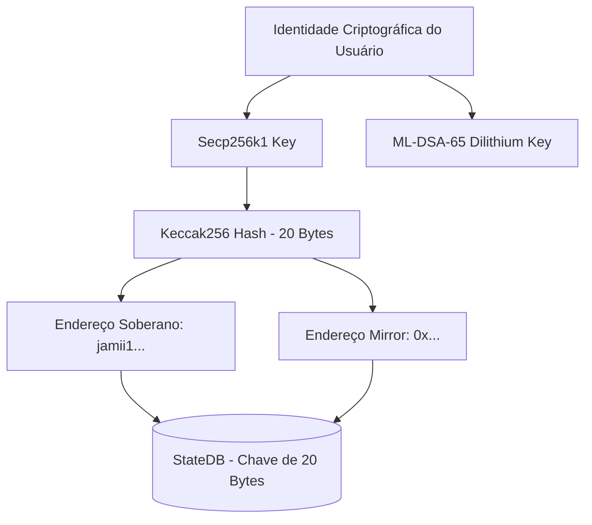
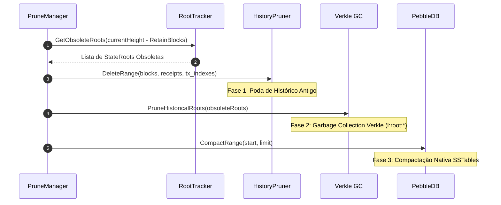
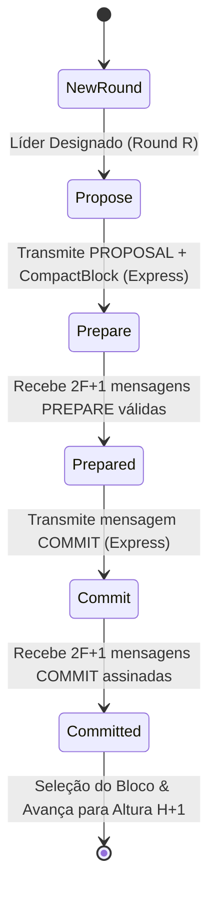

# 🏛️ Documentação Técnica de Arquitetura — Jamii Blockchain

> **Autoridade Técnica e Especificação Arquitetural Interna**  
> **Projeto:** Jamii Blockchain  
> **Versão da Documentação:** 2.5 (Atualizado — Agosto de 2026)  
> **Estado do Core:** Sprint 9.4 Concluída com Bonsai Turbo, Async Write Worker, DTS Dual-Channel, Verkle Trie Homomórfica e Poda de 3 Fases.

---

## 📑 Sumário

1. [Visão Geral e Filosofia Soberana Pós-Quântica](#1-visão-geral-e-filosofia-soberana-pós-quântica)
   - [1.1 Criptografia Híbrida L3 (ML-DSA-65 + Secp256k1)](#11-criptografia-híbrida-l3-ml-dsa-65--secp256k1)
   - [1.2 Identidade Unificada Shadowless](#12-identidade-unificada-shadowless)
2. [Arquitetura de Estado e Armazenamento (`pkg/store` & `pkg/trie`)](#2-arquitetura-de-estado-e-armazenamento-pkgstore--pkgtrie)
   - [2.1 Bonsai Turbo: Acesso a Estado em Tempo Constante O(1)](#21-bonsai-turbo-acesso-a-estado-em-tempo-constante-o1)
   - [2.2 Motor Dual-Trie: Verkle Trie Homomórfica vs SMT](#22-motor-dual-trie-verkle-trie-homomórfica-vs-smt)
   - [2.3 Poda em Disco em 3 Fases (Bonsai Turbo Pruning)](#23-poda-em-disco-em-3-fases-bonsai-turbo-pruning)
   - [2.4 Worker de Gravação Assíncrono (`AsyncWriteWorker`)](#24-worker-de-gravação-assíncrono-asyncwriteworker)
3. [Motor de Execução, VM e EVM-Compliance (`pkg/vm` & `pkg/core`)](#3-motor-de-execução-vm-e-evm-compliance-pkgvm--pkgcore)
   - [3.1 Máquina Virtual Jamii (EVM Dual-Engine)](#31-máquina-virtual-jamii-evm-dual-engine)
   - [3.2 Gestão de Gas, EIP-1559 e BaseFee](#32-gestão-de-gas-eip-1559-e-basefee)
   - [3.3 Estratégia Decrescente de Numeração de Pré-Compilados](#33-estratégia-decrescente-de-numeração-de-pré-compilados)
4. [Motor de Consenso IBFT 2.0 & Sincronismo (`pkg/consensus/ibft` & `pkg/blockchain`)](#4-motor-de-consenso-ibft-20--sincronismo-pkgconsensusibft--pkgblockchain)
   - [4.1 Ciclo de Vida de Três Fases (Propose, Prepare, Commit)](#41-ciclo-de-vida-de-três-fases-propose-prepare-commit)
   - [4.2 Block Pacing Temporal de Sub-Segundo & Timeout Linear](#42-block-pacing-temporal-de-sub-segundo--timeout-linear)
   - [4.3 Resiliência de Consenso: Watchdog, Fast-Path e Locked Block](#43-resiliência-de-consenso-watchdog-fast-path-e-locked-block)
   - [4.4 Purga Obrigatória de MemPool & Maturação por Altura](#44-purga-obrigatória-de-mempool--maturação-por-altura)
   - [4.5 SyncManager, Inércia Sequencial & Torrent Sync Fallback](#45-syncmanager-inércia-sequencial--torrent-sync-fallback)
5. [Motor P2P - DTS (Distributed Transaction Store) & Data Plane BitTorrent (`pkg/dts`)](#5-motor-p2p---dts-distributed-transaction-store--data-plane-bittorrent-pkgdts)
   - [5.1 Arquitetura Dual-Channel (EXPRESS & BULK)](#51-arquitetura-dual-channel-express--bulk)
   - [5.2 Mandato de Identificação Soberana Bech32](#52-mandato-de-identificação-soberana-bech32)
   - [5.3 Esqueleto Bi-Polar Compacto (Bi-Polar Skeleton)](#53-esqueleto-bi-polar-compacto-bi-polar-skeleton)
   - [5.4 Segurança de Memória (Anti-OOM DoS) & SafeClose](#54-segurança-de-memória-anti-oom-dos--safeclose)
6. [Camada JSON-RPC 2.0, Telemetria & Modos de Nó (`pkg/rpc` & `pkg/node`)](#6-camada-json-rpc-20-telemetria--modos-de-nó-pkgrpc--pkgnode)
   - [6.1 Servidor JSON-RPC 2.0 e RPC Sync Guard](#61-servidor-json-rpc-20-e-rpc-sync-guard)
   - [6.2 Métricas e Telemetria Prometheus (`/metrics`)](#62-métricas-e-telemetria-prometheus-metrics)
   - [6.3 Modos de Operação (Validador Core, Archiver e Stateless)](#63-modos-de-operação-validador-core-archiver-e-stateless)

---

## 1. Visão Geral e Filosofia Soberana Pós-Quântica

A **Jamii Blockchain** foi projetada para ser a infraestrutura de camada 1 soberana de alta vazão para a era pós-quântica. O projeto combina compatibilidade industrial com o ecossistema EVM (Ethereum Virtual Machine) e inovações de engenharia em tempo de execução nativo Go.

### 1.1 Criptografia Híbrida L3 e Agilidade Criptográfica (*Signature Agility*)

Para garantir segurança contínua contra ataques de computadores quânticos enquanto preserva o ecossistema de carteiras e ferramentas existentes, a Jamii adota um esquema de **Assinatura Híbrida Dual** com **Agilidade Criptográfica (*Signature Agility*)**:

* **ML-DSA-65 (FIPS 204 / Dilithium Level 3)**: Algoritmo de assinatura pós-quântica baseado em reticulados (*lattices*). É utilizado para a autoridade de nós validadores no consenso IBFT 2.0, identificação P2P no protocolo DTS e assinação soberana de transações de alto nível.
* **Secp256k1 (ECDSA)**: Algoritmo elíptico tradicional. É utilizado para a geração do par de chaves inicial e derivação determinística do hash de endereço.

No código-fonte ([`pkg/crypto/signer`](file:///c:/Magno/Projetos/jamii/pkg/crypto/signer)), a estrutura `SovereignSigner` gerencia a assinatura dupla. O payload assinado contém o compromisso com a chave pública pós-quântica e com o hash Secp256k1:

$$\text{SovereignIdentity} = \text{Keccak256}(\text{PublicKey}_{\text{Secp256k1}})[12:32]$$

#### Domínio de Algoritmos Criptográficos (`Algorithm uint8`)

A rede utiliza um byte de prefixo autodescritivo em todas as chaves e assinaturas. O sistema suporta e prevê o seguinte domínio de algoritmos:

| ID (`Algorithm`) | Nome / Esquema | Categoria | Tamanho PubKey | Tamanho Assinatura | Status no Projeto | Descrição / Uso |
| :---: | :--- | :---: | :---: | :---: | :---: | :--- |
| `0x00` | **Secp256k1** | Tradicional | 33 / 65 bytes | 64/65 bytes | **Homologado** | Compatibilidade ECDSA / Ethereum. |
| `0x01` | **MLDSA65** | PQC Puro | 1.953 bytes | 3.309 bytes | **Homologado** | NIST FIPS 204 (Dilithium L3). |
| `0x02` | **Hybrid-MLDSA** | Híbrido | 1.991 bytes | 3.377 bytes | **Homologado** | Dual Security (Secp256k1 + ML-DSA-65). |
| `0x03` | **Falcon512** | PQC Puro | 898 bytes | 666 bytes | *Planejado* | NIST FIPS Round 4 (NTRU Lattice). Ultracompacto. |
| `0x04` | **SLHDSA128f** | PQC Puro | 33 bytes | ~7.856 bytes | *Planejado* | NIST FIPS 205 (SPHINCS+ Stateless Hash). Zero lattices. |
| `0x05` | **Hybrid-Falcon** | Híbrido | ~935 bytes | ~734 bytes | *Planejado* | Dual Security ultracompacto (Secp256k1 + Falcon-512). |
| `0x06` | **Hybrid-SLHDSA** | Híbrido | ~70 bytes | ~7.924 bytes | *Planejado* | Dual Security estateless conservador. |

#### Seleção de Algoritmo via Genesis e APIs do Código

O criador da rede pode especificar o algoritmo padrão no `genesis.json` via parâmetro `"defaultQuantumAlgo": "MLDSA65"`. As APIs internas do nó e do SDK suportam a geração parametrizada:
- **Nó Go (`pkg/node/identity.go`):** `node.LoadOrCreateNodeKeyWithAlgo(dataDir, keyFileName, algo)`
- **Carteira/SDK (`pkg/wallet/wallet.go`):** `wallet.FromMnemonicWithAlgo(mnemonic, password, algo)`

### 1.2 Identidade Unificada Shadowless

Diferente de outras redes que exigem contratos pontes ou migração de saldos para adotar chaves pós-quânticas, a Jamii possui **Zero Migration UX** através da **Identidade Unificada Shadowless**:



* **Endereço Soberano (Bech32)**: Apresentação nativa no formato `jamii1...` (ex: `jamii1z7fsyg98ejec8vhg7mdyruus0v676jd5ryxa62v`), codificada via Bech32 com verificação de erros.
* **Endereço Mirror (EVM Hex)**: Apresentação hexadecimal no formato EIP-55 `0x...` (ex: `0xa660f35cb1d29acd4ab4771df5ea44fa06202228`).

Ambas as representações mapeiam para os **mesmos 20 bytes físicos** no banco de dados (`StateDB`). Uma transferência realizada para o endereço `0x...` credita instantaneamente o saldo visível no endereço `jamii1...` correspondente, sem contratos intermediários.

---

## 2. Arquitetura de Estado e Armazenamento (`pkg/store` & `pkg/trie`)

A camada de armazenamento da Jamii resolve o histórico gargalo de I/O de blockchains baseadas em Merkle Patricia Tries (como Geth), onde cada leitura de saldo exige $O(\log N)$ acessos síncronos ao disco.

### 2.1 Bonsai Turbo: Acesso a Estado em Tempo Constante $O(1)$

A Jamii implementa a arquitetura **Bonsai Turbo** em cima do banco de dados de alto desempenho **PebbleDB** (LSM-Tree nativa em Go, desenvolvida pela CockroachDB):

```
+-----------------------------------------------------------------------+
|                            STATE DB                                   |
+-----------------------------------------------------------------------+
|  Flat State (Chave-Valor Direct View):                                |
|    - d:account_hash -> { Balance, Nonce, CodeHash }  [Acesso O(1)]    |
|    - s:account_hash:slot_hash -> StorageValue        [Acesso O(1)]    |
+-----------------------------------------------------------------------+
|  Trie State (Estrutura Criptográfica Assíncrona):                     |
|    - r:root_hash -> TrieNodeData                                      |
|    - l:root_hash:slot -> RollbackLogData                             |
+-----------------------------------------------------------------------+
```

* **Flat State (`d:*` e `s:*`)**: Armazena o estado atual das contas e slots de armazenamento de contratos diretamente em tabelas chave-valor simples. Leituras (`GetBalance`, `GetNonce`) e escritas durante a execução da EVM acontecem em tempo constante $O(1)$ em memória RAM e disco.
* **Cálculo da Raiz de Estado Assíncrono**: A construção da árvore de estado e a geração do `StateRoot` ocorrem após o processamento das transações do bloco, sem bloquear a execução da EVM.

### 2.2 Motor Dual-Trie: Verkle Trie Homomórfica vs SMT

Através do padrão **Trie Factory** ([`pkg/trie`](file:///c:/Magno/Projetos/jamii/pkg/trie)), o nó Jamii pode ser configurado via `genesis.json` para operar com duas estruturas de árvore de estado:

| Característica | Verkle Trie Homomórfica (Default) | SMT (Sparse Merkle Trie) |
| :--- | :--- | :--- |
| **Parâmetro Genesis** | `treeType: 2` | `treeType: 1` |
| **Mecanismo Criptográfico** | Compromissos Polinomiais IPA / Bandersnatch | Hashing Keccak-256 Paralelo |
| **Largura de Aridade** | 256 Filhos por Nó | 2 Filhos por Nó (Binária) |
| **Tamanho da Prova (Witness)** | Ultra-compacta ($\approx 200\text{ bytes}$) | Médio a Grande ($\approx 2-8\text{ KB}$) |
| **Uso Principal** | Redes de Produção (Mainnet / Testnet) | Ambientes Legados / Debug |

No modo **Verkle Trie**, a Jamii utiliza compromissos polinomiais sobre a curva elíptica Bandersnatch. Isso permite que provadores gerem um **Witness** extremamente pequeno, possibilitando validação stateless e verificação de blocos em milissegundos.

### 2.3 Poda em Disco em 3 Fases (Bonsai Turbo Pruning)

Para evitar que o banco de dados PebbleDB cresça indefinidamente, o nó implementa o ciclo de poda em 3 fases gerenciado pelo `PruneManager` ([`pkg/node/prune_manager.go`](file:///c:/Magno/Projetos/jamii/pkg/node/prune_manager.go)):



1. **Fase 1 — Poda de Histórico (`HistoryPruner`)**: Executa `DeleteRange` no PebbleDB removendo blocos antigos, recibos e índices de busca passados além da janela de retenção `PruneRetainBlocks` (padrão 1.024 blocos).
2. **Fase 2 — Garbage Collection Verkle (`PruneHistoricalRoots`)**: Executa o expurgo em faixa de logs de rollback obsoletos (`l:<rootHex>:*`) em [`pkg/trie/verkle/gc.go`](file:///c:/Magno/Projetos/jamii/pkg/trie/verkle/gc.go), mantendo 100% íntegro o Flat State (`d:*`).
3. **Fase 3 — Compactação Nativa PebbleDB (`CompactRange`)**: Invoca `p.db.Compact(start, limit, false)` em [`pkg/store/pebble.go`](file:///c:/Magno/Projetos/jamii/pkg/store/pebble.go), forçando o sistema operacional a liberar o espaço físico em disco dos arquivos `.sst`.

> [!NOTE]
> A poda é automaticamente desativada durante a fase de sincronismo inicial (*Catch-Up Sync Protection*) para evitar inconsistências no estado enquanto o nó baixa o histórico.

### 2.4 Worker de Gravação Assíncrono (`AsyncWriteWorker`)

Para que o consenso avança sem ficar travado pela latência de I/O de disco (que pode levar de 500ms a 700ms por bloco), a Jamii adota o **`AsyncWriteWorker`** ([`pkg/node/async_write_worker.go`](file:///c:/Magno/Projetos/jamii/pkg/node/async_write_worker.go)):

* **Fila Buferizada em RAM**: O callback de consenso `OnBlockFinalized` envia a tarefa de persistência para uma fila em RAM (`maxQueueSize = 32`) e libera a rodada de consenso imediatamente em $< 5\text{ ms}$.
* **Controle de Congestionamento (Backpressure)**: Se a fila atingir 32 blocos pendentes, o worker passa a processar de forma síncrona até que a fila desobstrua.
* **Busca em 3 Níveis (`handleBlockRequest`)**: Quando um nó par solicita um bloco via P2P, o nó busca em: (1) Banco PebbleDB no disco $\to$ (2) Fila em RAM do `AsyncWriteWorker` $\to$ (3) Cache em memória `PayloadPool`.

---

## 3. Motor de Execução, VM e EVM-Compliance (`pkg/vm` & `pkg/core`)

O motor de execução é a unidade responsável por aplicar transações e alterar o estado global da rede.

### 3.1 Máquina Virtual Jamii (EVM Dual-Engine)

A VM da Jamii foi construída com foco em máxima eficiência de alocação de memória e proteção DoS:

* **Pilha LIFO Otimizada ("Top op Next")**: Minimiza movimentação de memória na pilha de operandos durante loops de execução de opcodes.
* **Aritmética Industrial de 256 Bits**: Utiliza a biblioteca interna [`pkg/types/uint256.go`](file:///c:/Magno/Projetos/jamii/pkg/types/uint256.go) que opera sobre arrays fixos de 4 palavras `uint64`, eliminando alocações na Heap e fornecendo checagem nativa de *overflow/underflow*.

### 3.2 Gestão de Gas, EIP-1559 e BaseFee

A Jamii segue rigorosamente a especificação EVM London/Besu para a precificação e cobrança de gas:

1. **Buy Gas (Pré-Compra)**: Antes de iniciar a execução da transação, o nó debita do saldo da conta o valor máximo potencial:
   $$\text{MaxCost} = \text{GasLimit} \times \text{GasPrice}$$
2. **Execução EVM**: Cada opcode consumido deduz o valor especificado de gas. Se o gas zerar, a execução é interrompida com exceção `OutOfGas` e todas as alterações de estado são revertidas.
3. **Refund Gas (Reembolso)**: Ao término bem-sucedido, o gas não utilizado é reembolsado para a conta de origem:
   $$\text{Refund} = (\text{GasLimit} - \text{GasUsed}) \times \text{GasPrice}$$
4. **ReceiptsRoot**: O cabeçalho de cada bloco contém o hash da raiz Merkle de todos os recibos de execução (`ReceiptsRoot`), registrando logs de eventos e consumo de gas.

### 3.3 Estratégia Decrescente de Numeração de Pré-Compilados

Conforme estabelecido no **Mandato 11**, para evitar conflitos com atualizações futuras do Ethereum (que utiliza endereços crescentes como `0x01`, `0x02`, `0x03`...), todos os contratos pré-compilados exclusivos da Jamii são numerados de **trás para frente**, partindo do topo do espaço de endereçamento de 20 bytes:

```
0x00000000000000000000000000000000ffffffff  <-- Topo do Espaço de Endereçamento
0x00000000000000000000000000000000fffffffe  <-- Reservado para Serviços Futuros
0x00000000000000000000000000000000fffffffd  <-- ValidatorRegistry Contract (Soberano)
```

O primeiro serviço a adotar esta convenção é o contrato **`ValidatorRegistry`** (localizado no endereço `0x00000000000000000000000000000000fffffffd`), responsável pelo registro on-chain da autoridade de validadores.

---

## 4. Motor de Consenso IBFT 2.0 & Sincronismo (`pkg/consensus/ibft` & `pkg/blockchain`)

O consenso da Jamii é uma implementação industrial do **IBFT 2.0 (Istanbul Byzantine Fault Tolerance)** com tolerância a falhas bizantinas de até $F$ nós em uma rede com $N \ge 3F+1$ validadores.

### 4.1 Ciclo de Vida de Três Fases (Propose, Prepare, Commit)



1. **PROPOSE**: O propositor da rodada $R$ (determinado por $P = (H + R) \bmod N$) seleciona transações da MemPool, constrói o `CompactBlock` e transmite o pacote `PROPOSAL` pelo canal **EXPRESS** do DTS.
2. **PREPARE**: Validadores executam o bloco em sandbox sobre o `StateDB`. Se o `StateRoot` coincidir, transmitem a mensagem `PREPARE`. Ao acumular $2F+1$ votos, a rodada atinge o estado **`PREPARED`**.
3. **COMMIT**: Validadores assinam o cabeçalho do bloco e transmitem a mensagem `COMMIT`. Ao acumular $2F+1$ selos assinados, o bloco é finalizado e selado.

### 4.2 Block Pacing Temporal de Sub-Segundo & Timeout Linear

Para garantir uma cadência regular na geração de blocos e evitar picos de tráfego, o motor adota:

* **Block Pacing de Sub-Segundo**: O propositor calcula o tempo exato do bloco anterior ($T_{\text{target}} = T_{\text{prev}} + \text{BlockPeriod}$) usando alta precisão temporária (`time.Duration`). A proposta é emitida rigorosamente no milissegundo do tempo alvo.
* **Timeout Linear Suave de Rodada**: Caso uma rodada não finalize a tempo, o tempo limite para a próxima rodada é calculado por:
  $$T_{\text{round}} = T_{\text{base}} + (R \times 2\text{s}) \quad \text{com teto máximo de } 20\text{s}$$

### 4.3 Resiliência de Consenso: Watchdog, Fast-Path e Locked Block

* **Watchdog de Liderança**: Nós validadores trocam mensagens de status a cada 5s. Se o propositor designado para a próxima rodada for detectado como inativo ou em modo de sincronização (`ready: false`), o nó aciona o **Fast-Path `READY`**, transitando de propositor em 5ms sem aguardar o timeout tradicional de 10s.
* **Garantia de Bloco Travado (Locked Block)**: Se uma rodada estourar o tempo limite após atingir o estado `PREPARED`, os validadores mantêm o bloco travado em RAM. Na rodada $R+1$, o novo propositor é **obrigado** a repropor o mesmo bloco travado (acompanhado dos certificados de `RoundChange`), garantindo que não ocorram bifurcações ou *double-spend*.

### 4.4 Purga Obrigatória de MemPool & Maturação por Altura

Conforme exigido pelas **Diretivas 16 e 17**:

* **Purga Obrigatória pós-Execução (Diretiva 16)**: Toda finalização de bloco invoca obrigatoriamente `n.mempool.SetBaseFee` e `n.mempool.Reset(n.state, block.Number())`. Isso limpa transações já mineradas e reavalia a fila pendente.
* **Maturação por Altura Incondicional (Diretiva 17)**: No método `GetExecutable` da MemPool, transações recebidas na altura $H$ aguardam obrigatoriamente até a altura $H+1$ para integrar propostas (`useHeightFilter := tp.currentHeight > 0`). Isso garante 1 rodada completa de fofoca P2P, assegurando 100% de reconstrução de blocos via Short IDs.

### 4.5 SyncManager, Inércia Sequencial & Torrent Sync Fallback

* **SyncManager**: Quando um nó detecta que está atrasado em relação aos seus pares (`IsBehind() == true`), o motor de consenso entra em estado de **HALT** e o `SyncManager` assume o controle baixando blocos sequencialmente de múltiplos pares em paralelo.
* **Fallback de Torrent Sync (Diretiva 19)**: Se a sincronização de chunks via BitTorrent falhar por 2 tentativas consecutivas, o sincronizador drenará os canais e mudará automaticamente para o **Sync P2P Sequencial clássico** (`RequestBlockByNumber`).

---

## 5. Motor P2P - DTS (Distributed Transaction Store) & Data Plane BitTorrent (`pkg/dts`)

O **DTS (Distributed Transaction Store)** é o motor de comunicação P2P de duas vias da Jamii.

### 5.1 Arquitetura Dual-Channel (EXPRESS & BULK)

Para impedir que downloads de blocos pesados travem as mensagens do consenso, o DTS abre **duas conexões TCP paralelas** por par:

```
+-----------------------------------------------------------------------+
|                         PEER CONNECTION                               |
+-----------------------------------------------------------------------+
|  ⚡ Canal EXPRESS (TCP Socket 1):                                     |
|    - Mensagens curtas de consenso: PROPOSE, PREPARE, COMMIT, ROUND_CHANGE |
|    - Latência de trânsito: < 1ms                                      |
+-----------------------------------------------------------------------+
|  🌐 Canal BULK (TCP Socket 2):                                        |
|    - Mensagens volumosas: Histórico de Blocos, Chunks e MsgData (TXs) |
|    - Transmissão direta sem handshake de 3 etapas                        |
+-----------------------------------------------------------------------+
```

* **Dual-Channel Gatekeeper (`IsPeerFullyConnected`)**: Um par só é considerado ativo e notificado à camada superior quando **ambos** os sockets (`Bulk` e `Express`) completarem com sucesso os seus handshakes criptográficos.

### 5.2 Mandato de Identificação Soberana Bech32

De acordo com as **Diretivas 13 e 14**:

* **BitTorrent Data Plane (Diretiva 13)**: A identificação de peers na rede de dados BitTorrent deve utilizar obrigatoriamente o **Endereço Soberano Jamii (Bech32, `jamii1...`)**. O uso de representação Hex (`0x...`) é estritamente proibido.
* **P2P Control Plane (`StaticPeers`) (Diretiva 14)**: A lista de pares estáticos deve seguir o formato `ENDEREÇO_SOBERANO@host:port` (ex: `jamii1z7fsyg...@127.0.0.1:30303`). O handshake valida se a chave pública derivada do socket confere com o endereço configurado. Se divergirmos, a conexão é encerrada imediatamente para impedir ataques de Sybil e Eclipse.

### 5.3 Esqueleto Bi-Polar Compacto (Bi-Polar Skeleton)

A Jamii reduz o consumo de banda de rede em **~95%** durante o consenso através do **Bi-Polar Skeleton**:

```json
{
  "shortId": "a1b2c3...d4e5f6"  // 3 Bytes Iniciais + 3 Bytes Finais do Hash da TX
}
```

Em vez de transmitir os bytes completos de 3.000 transações na mensagem de proposta, o propositor envia apenas os **Short IDs de 6 bytes**. Como as transações já foram propagadas previamente via canal BULK, os nós validadores reconstroem o bloco completo em memória local instantaneamente.

### 5.4 Segurança de Memória (Anti-OOM DoS) & SafeClose

* **Leitura Incremental de Memória (Anti-OOM Protection)**: Ao ler pacotes da rede em `readMessage()`, o DTS aloca memória de forma incremental em chunks de 64 KB, impedindo que conexões maliciosas declarem um tamanho gigantesco no cabeçalho para provocar estouro de memória (*Out Of Memory*).
* **SafeClose**: Encerramento idempotente de sockets P2P e canais de sinalização via `sync.Once`, evitando exceções de pânico (`panic: close of closed channel`).

---

## 6. Camada JSON-RPC 2.0, Telemetria & Modos de Nó (`pkg/rpc` & `pkg/node`)

### 6.1 Servidor JSON-RPC 2.0 e RPC Sync Guard

O módulo [`pkg/rpc`](file:///c:/Magno/Projetos/jamii/pkg/rpc) fornece uma interface HTTP/JSON-RPC 2.0 compatível com as especificações da Web3 e ferramentas Ethereum:

* **Métodos Suportados**: `eth_chainId`, `eth_blockNumber`, `eth_getBalance`, `eth_getTransactionCount`, `eth_sendRawTransaction`, `eth_call`, `eth_estimateGas`, `eth_getBlockByNumber`, `eth_getTransactionReceipt`, etc.
* **RPC Sync Guard**: Se o nó estiver executando o sincronismo histórico (`SyncManager.IsBehind() == true`), os métodos de escrita e leitura de estado retornam imediatamente a rejeição tratada:
  ```json
  {
    "error": "Node in sync mode, retry later"
  }
  ```

### 6.2 Métricas e Telemetria Prometheus (`/metrics`)

O servidor expõe o endpoint `/metrics` para raspagem (*scraping*) por coletores Prometheus e exibição nos painéis do Grafana:

| Nome da Métrica | Tipo | Descrição |
| :--- | :---: | :--- |
| `jamii_blockchain_effective_tps` | Gauge | Vazão real de transações por segundo seladas em bloco na janela deslizante de 10s. |
| `jamii_blockchain_total_transactions_total` | Counter | Total acumulado de transações confirmadas na cadeia desde o boot. |
| `jamii_blockchain_block_time_ms` | Gauge | Tempo decorrido em milissegundos ($ms$) entre commits de blocos consecutivos. |
| `jamii_db_commit_micros` | Gauge | Latência de gravação física do estado no PebbleDB em microsegundos ($\mu s$). |
| `jamii_async_worker_queue_length` | Gauge | Quantidade de blocos aguardando gravação assíncrona na fila do `AsyncWriteWorker`. |
| `jamii_dts_traffic_kbps` | Gauge | Taxa de transferência de rede P2P em KB/s separada por canal (`express`/`bulk`) e direção (`in`/`out`). |

### 6.3 Modos de Operação (Validador Core, Archiver e Stateless)

Através do arquivo de configuração `config.yaml` ([ver guia `CONFIG.md`](file:///c:/Magno/Projetos/jamii/CONFIG.md)), o nó Jamii pode ser implantado em 3 modos operacionais:

1. **Nó Validador Core (Produção / Testes)**:
   - Configuração: `miner_enabled: true`, `prune_enabled: true` (janela de 1.024 a 50.000 blocos).
   - Função: Participa ativamente da votação do consenso IBFT 2.0 e mantém o banco de dados enxuto em disco.
2. **Nó Arquivador Soberano (`Archiver`)**:
   - Configuração: `is_archive_node: true`, `prune_enabled: false`.
   - Função: Guarda 100% da história da blockchain desde o Bloco #0 até o topo. Atende a requisições de sincronismo inicial de novos nós na rede.
3. **Nó Leitor Stateless (`stateless`)**:
   - Configuração: `stateless: true`.
   - Função: Executa inteiramente em memória RAM sem persistir banco de dados em disco, servindo como nó de consulta ultra-rápido para APIs e Exploradores.
