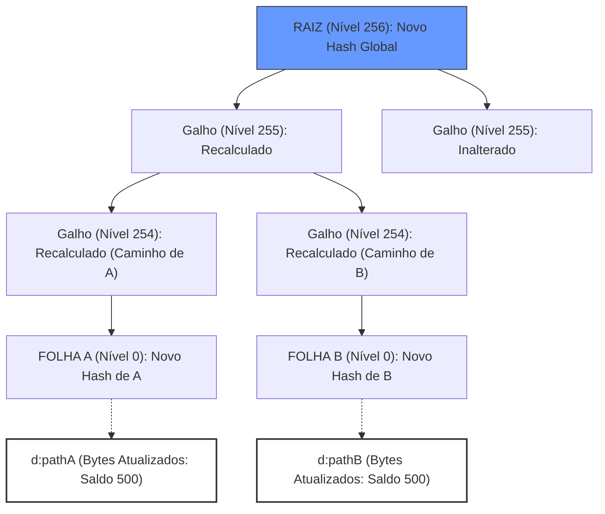

# 📑 Arquitetura de Produção de Blocos e Estado (Nível 4)

Este documento descreve o fluxo técnico real da Jamii Blockchain, detalhando a mecânica da **Sparse Merkle Tree (SMT)** e o modelo de **Armazenamento Híbrido (Flat + Tree)**.

---

## 1. Princípios de Engenharia Jamii
Diferente da EVM tradicional (Geth), onde a navegação na árvore é obrigatória para leitura, a Jamii utiliza um modelo de **Performance Industrial**:
1.  **Dados Flat (D:):** O banco de dados armazena os estados das contas de forma direta para leitura $O(1)$.
2.  **Integridade Merkle (N:):** Uma árvore esparsa de 256 níveis gera provas de integridade.

---

## 2. Definições Técnicas (Sem Analogias)

### A. Nível (Level)
Representa a profundidade da árvore, variando de 0 a 256. Cada nível corresponde a um bit do hash do endereço (Path).
*   **Nível 256 (Raiz):** O hash final que representa o estado global.
*   **Nível 1 a 255 (Galhos):** Nós intermediários que validam sub-ramos.
*   **Nível 0 (Folha):** O ponto de encontro entre a árvore e o dado real.

### B. O Galho (Nó Intermediário)
Um galho armazena apenas um **Hash de 32 bytes**.
*   **Cálculo:** `NodeHash = Keccak256(LeftChildHash || RightChildHash)`.
*   **Propósito:** Fornecer um caminho criptográfico (Merkle Proof) da folha até a raiz.

### C. A Folha (Nível 0) - O "Compromisso"
A folha **não armazena o saldo**. Ela funciona como uma **Foreign Key Criptográfica**.
*   **Conteúdo:** Um Hash de 32 bytes (`Keccak256` dos dados da conta).
*   **Função:** Garantir a imutabilidade do dado armazenado no banco paralelo. Se o dado no banco paralelo for alterado, o hash da folha deixará de bater, invalidando a árvore inteira até a raiz.

### D. O Banco Paralelo (Flat) - O "Registro"
Localizado sob o prefixo `d:`, armazena a struct `jamiiAccount` (aprox. 104 bytes).
*   **Estrutura:** `[Balance(32) | Nonce(8) | CodeHash(32) | StorageRoot(32)]`.
*   **Vantagem:** Permite leitura instantânea do saldo sem percorrer os 256 níveis da árvore.

---

## 3. A Regra de Ouro da Navegação (Bit-Mapping)

A navegação na SMT é puramente matemática e baseada nos bits do **Path** (Hash do Endereço).

| Bit do Path | Direção na Árvore | Destino |
| :--- | :--- | :--- |
| **0** | Esquerda (Left) | Sub-ramo inferior esquerdo |
| **1** | Direita (Right) | Sub-ramo inferior direito |

**Exemplo de Caminho:**
Se o hash da conta começa com `10...` (binário):
1.  **Nível 256 (Raiz):** Bit é `1` $\rightarrow$ Vá para a **Direita**.
2.  **Nível 255:** Bit é `0` $\rightarrow$ Vá para a **Esquerda**.
3.  ... repete até o **Nível 0** (Folha).

---

## 4. Fase 0: O Bloco Gênese (#0) - Armazenamento Real

Quando a Gênese é criada, o PebbleDB recebe dois tipos de registros para cada conta:

### Representação no PebbleDB (Chave-Valor)
| Tipo | Chave (Key) | Valor (Value) | Descrição |
| :--- | :--- | :--- | :--- |
| **DADO** | `d:0aef64...` | `[Saldo: 1000, Nonce: 0, ...]` | O estado real da conta (Bytes). |
| **NÓ 0** | `n:0000:0aef64...` | `0x6d8e3d...` | Hash da conta (Leaf Hash). |
| **NÓ 1** | `n:0001:0aef64...` | `0x12a3b4...` | Hash combinado do Nível 0. |
| ... | ... | ... | ... |
| **RAIZ** | `n:0256:000000...` | `0xaa6e3c...` | **StateRoot** (A cabeça da árvore). |

---

## 4. Fase 1: Transação e Evolução do Estado (A -> 500 -> B)

Ao processar uma transação, o sistema não altera a árvore bit a bit. Ele faz um **UpdateBatch**:

1.  **Leitura do Banco:** O Processor lê `d:pathA` e `d:pathB` via busca flat direta ($O(1)$).
2.  **Cálculo:** Subtrai 500 de A e soma 500 em B.
3.  **Serialização:** Gera novos bytes para A e B.
4.  **Escrita de Dados:** Grava os novos bytes em `d:pathA` e `d:pathB`.
5.  **Re-hashing da Árvore:**
    *   Calcula `NovoLeafHashA = Keccak256(NovosBytesA)`.
    *   Calcula `NovoLeafHashB = Keccak256(NovosBytesB)`.
    *   Sobe a árvore recalculando apenas os nós `n:` que estão no caminho de A e B até a Raiz.

### Diagrama de Atualização da SMT (Nível 256 down to 0)

## 7. O Princípio do Staging e State Promotion (Otimização Soberana)

Para evitar a re-execução redundante e o custo de CPU da Verkle Tree, a Jamii utiliza um fluxo de **Staging Avançado**:

1.  **Execução em Sandbox (GetPayload/Verify):** O Proposer (ao montar o bloco) e os Validadores (ao verificar a proposta) executam as transações em um `StateDB` isolado (Sandbox).
2.  **Cálculo da Raiz e IPA:** O sandbox gera a `StateRoot` e calcula todos os compromissos IPA da Verkle Tree, armazenando-os em um `OverlayStore` em RAM.
3.  **Promoção de Estado (O Pulo do Gato):** No momento da finalização (Commit), o sistema não re-executa o bloco. Ele utiliza o método `Promote()`, que move os nós da Trie e os estados das contas do Sandbox diretamente para o banco canônico.
4.  **Efetivação Instantânea:** O `Commit()` final torna-se apenas uma operação de escrita de disco (I/O plano), pois a matemática pesada já foi resolvida e "promovida" da fase de consenso.

---

## 8. O Mecanismo de "Reboot" e Persistência

O segredo está no **Header do Bloco**. 
No momento em que o nó reinicia:
1.  Ele abre o PebbleDB.
2.  Lê o último bloco homologado e extrai a `StateRoot`.
3.  Instancia a SMT e executa `SMT.SetRoot(StateRoot)`.
4.  A partir daí, qualquer consulta de saldo lê o dado `d:` e, **se solicitado pelo validador**, confirma contra os nós `n:` que já estão no disco. 

A SMT da Jamii é eficiente porque ela **não precisa ler a árvore inteira para saber um saldo**, mas ela **precisa da árvore inteira para validar um bloco**.

---

## 6. Conclusão: O Efeito Cascata e a Prova Soberana

O que garante a segurança da rede é o **Efeito Cascata**:
1.  **Alteração:** Se um saldo muda em `d:`, o sistema gera um novo hash para a conta.
2.  **Propagação:** Este novo hash altera a folha `n:0000`, que altera o galho `n:0001`, subindo bit a bit até a Raiz.
3.  **Consenso:** A **StateRoot** resultante é o compromisso final. Se dois nós executarem a mesma transação e chegarem a raízes diferentes, a rede detecta a fraude instantaneamente.

**A Raiz é a Prova:** Se a minha raiz é igual à sua, temos a garantia criptográfica de que todos os milhões de saldos no meu SSD são idênticos aos seus, sem precisarmos comparar conta por conta.

---

## 9. Benchmarks de Homologação (Performance Real)

Medições realizadas em ambiente de auditoria industrial (Abril 2026), utilizando criptografia híbrida (Secp256k1 + ML-DSA) e persistência em SSD (PebbleDB).

### Cenário A: Alta Frequência (IO-Bound)
*   **Configuração:** 50 Transações por Bloco.
*   **Objetivo:** Estressar a integridade de escrita e sincronização Merkle.
*   **Resultado:** **~300 TPS** (Transações por Segundo).
*   **Estabilidade:** Fluxo constante de I/O, ideal para redes que exigem baixa latência de confirmação.

### Cenário B: Alta Capacidade (Batch-Optimized)
*   **Configuração:** 1.000 Transações por Bloco.
*   **Objetivo:** Medir o throughput máximo do motor de execução.
*   **Resultado:** **~3.037 TPS**.
*   **Eficiência:** Peak Heap de **43.19 MB**, demonstrando gerenciamento de memória superior mesmo sob carga massiva de 60.000+ transações.

---
**Documento homologado em 24/04/2026.**
**Status: Integridade Industrial Nível 4 (Reboot-Safe).**
